# ABB_IRB 神经网络逆运动学工程 / ABB_IRB Neural IK Project

本项目围绕 `ABB IRB 1200-7/0.7` 机械臂，建立了一套从运动学建模、数据生成、分段神经网络逆运动学、分层分类候选生成、数值法校正到可视化与 benchmark 的完整研究链路。当前工程重点不是控制器级工业部署，而是形成一套可验证、可扩展、可用于本科毕业设计论文撰写的研究型实现。

> 说明：
> - 按时间顺序的实验记录、命令记录和阶段性讨论，已统一移动到 [Summary.md](Summary.md)。
> - 本 `README.md` 负责说明当前工程的总体流程、数学模型、核心脚本职责、性能指标与复现实验入口。

## 1. 当前完成状态

截至目前，工程已经完成以下核心环节：

1. `ABB_IRB` 机械臂标准 `DH` 建模与 `FK` 验证。
2. 两套关节子空间划分方案：`abb_simplified = 96`、`abb_strict = 192`。
3. 基于 `abb_strict` 的 `192` 个子空间回归器训练与保存。
4. 单层 `192` 类分类器基线训练与保存。
5. 两层分层分类器训练与保存：
   - 第一层粗分类：`shoulder / elbow / wrist`
   - 第二层细分类：`q2_bin / q4_bin / q6_bin`
6. `predict_ik.py` 完整推理链路：
   - 候选子空间生成
   - 子空间回归初值预测
   - `FK` 回代筛选
   - 阻尼 `Newton-Raphson` 局部精修
   - 时间统计输出
7. 工作空间参考样本导出、图表生成与 `100` 样本 benchmark。
8. `NN only / NN + NR / DLS / Multi-start DLS / L-BFGS-B / Multi-start L-BFGS-B` 六组逆解对比实验。

## 2. 项目主流程

当前推荐的正式流程如下：

1. 根据 `robot_config.py` 确定机械臂参数、关节限位和 `DH` 偏置。
2. 使用 `fk_model.py` 建立正运动学、`pose6` 和数值雅可比。
3. 在关节空间内按子区间划分得到 `96/192` 个子空间。
4. 对每个子空间采样关节角，通过 `FK` 生成位姿样本，训练局部回归网络。
5. 训练分类器，将目标位姿映射到候选子空间集合。
6. 用候选子空间对应的回归器生成逆解初值。
7. 对每个初值执行 `FK` 回代，按位置误差筛选最优初值。
8. 采用阻尼 `Newton-Raphson` 进行局部修正，获得最终逆解。
9. 对最终逆解进行位置误差、姿态误差和时间统计。

可概括为：

```text
目标位姿
  -> 分类器产生候选子空间
  -> 子空间回归器输出初值
  -> FK回代筛选
  -> NR局部精修
  -> 最终逆解 + 误差 + 时间
```

## 3. 目录与主文件职责

### 3.1 根目录关键文件

| 文件 | 作用 |
|---|---|
| `robot_config.py` | 机器人统一配置：DH 参数、关节限位、偏置、单位约定 |
| `fk_model.py` | 正运动学、`pose6` 计算、关节点坐标、欧拉角变换、数值雅可比 |
| `train_prediction_models.py` | 训练每个子空间的局部回归器 |
| `train_classification_models.py` | 训练单层 `96/192` 类分类器基线 |
| `train_branch_classification_models.py` | 训练第一层粗分类器 |
| `train_fine_classification_models.py` | 训练第二层细分类器 |
| `predict_hierarchical_candidates.py` | 只分析分层分类候选，不输出最终逆解 |
| `predict_ik.py` | 当前正式在线推理入口 |
| `generate_dataset.py` | 全局随机采样并生成 `FK` 数据 |
| `export_subspace_reference_data.py` | 导出每个子空间的参考样本 |
| `Summary.md` | 时间顺序的记录页 |

### 3.2 子目录说明

| 目录 | 内容 |
|---|---|
| `abb_nn/` | 神经网络模型、子空间划分、分层标签、优化模块 |
| `artifacts/` | 已训练模型、验证报告、推理结果 |
| `data/` | 数据集与子空间参考样本 |
| `docs/` | 参数资料、说明文档 |
| `figure/` | 绘图脚本、图表数据与最终 PNG 图像 |
| `scripts/` | 独立验证脚本 |

## 4. 机械臂运动学模型

### 4.1 位姿表示

工程中统一采用 `6` 维末端位姿：

$$
\mathbf{x} = [x,\ y,\ z,\ \phi,\ \theta,\ \psi]^\top,
$$

其中：

- $x,y,z$ 单位为 `mm`
- $(\phi,\theta,\psi)$ 为 `ZYX Euler` 角，单位为 `rad`

### 4.2 标准 DH 参数

当前采用 `Standard DH` 建模，参数如下：

| 关节 $i$ | $a_i$ (mm) | $\alpha_i$ (deg) | $d_i$ (mm) | $\theta_i$ |
|---|---:|---:|---:|---|
| 1 | 0.0 | -90 | 399.1 | $q_1$ |
| 2 | 350.0 | 0 | 0.0 | $q_2 - 90^\circ$ |
| 3 | 42.0 | -90 | 0.0 | $q_3$ |
| 4 | 0.0 | 90 | 351.0 | $q_4$ |
| 5 | 0.0 | -90 | 0.0 | $q_5$ |
| 6 | 0.0 | 0 | 82.0 | $q_6$ |

其中第 2 关节采用固定偏置：

$$
\theta_2 = q_2 - 90^\circ.
$$

### 4.3 单关节齐次变换矩阵

标准 `DH` 下，第 $i-1$ 坐标系到第 $i$ 坐标系的变换为：

$$
{}^{i-1}\mathbf{T}_i =
\begin{bmatrix}
\cos\theta_i & -\sin\theta_i\cos\alpha_i & \sin\theta_i\sin\alpha_i & a_i\cos\theta_i \\
\sin\theta_i & \cos\theta_i\cos\alpha_i & -\cos\theta_i\sin\alpha_i & a_i\sin\theta_i \\
0 & \sin\alpha_i & \cos\alpha_i & d_i \\
0 & 0 & 0 & 1
\end{bmatrix}.
$$

末端相对基座的齐次变换为：

$$
{}^{0}\mathbf{T}_6 = {}^{0}\mathbf{T}_1\,{}^{1}\mathbf{T}_2\,{}^{2}\mathbf{T}_3\,{}^{3}\mathbf{T}_4\,{}^{4}\mathbf{T}_5\,{}^{5}\mathbf{T}_6
= \begin{bmatrix}
\mathbf{R}_{06} & \mathbf{p}_{06} \\
\mathbf{0}_{1\times 3} & 1
\end{bmatrix}.
$$

其中：

- $\mathbf{p}_{06} \in \mathbb{R}^3$ 为末端位置向量
- $\mathbf{R}_{06} \in SO(3)$ 为末端旋转矩阵

### 4.4 数值雅可比

当前 `NR` 校正使用数值雅可比：

$$
\mathbf{J}_{:,i}(\mathbf{q}) \approx
\frac{\mathbf{x}(\mathbf{q}+h\mathbf{e}_i) - \mathbf{x}(\mathbf{q}-h\mathbf{e}_i)}{2h},
\quad h=10^{-6}.
$$

这与 `fk_model.py` 中 `numerical_pose_jacobian_rad(...)` 的实现一致。

### 4.5 关节限位

当前项目建模限位为：

$$
\begin{aligned}
q_1 &\in [-170^\circ, 170^\circ], \\
q_2 &\in [-100^\circ, 135^\circ], \\
q_3 &\in [-200^\circ, 70^\circ], \\
q_4 &\in [-270^\circ, 270^\circ], \\
q_5 &\in [-130^\circ, 130^\circ], \\
q_6 &\in [-180^\circ, 180^\circ].
\end{aligned}
$$

说明：第 6 轴在官方规格中可达 `±400°`，但当前工程为了控制数据规模与分段复杂度，将其压缩为单圈范围。

### 4.6 第 2 关节偏置验证结果

通过 ABB 官方工作范围图中的典型腕中心点进行反校核，当前 `theta2_offset = -90°` 是正确建模方式。验证结果如下：

| $\theta_2$ 偏置假设 | 平均 `XZ` 误差 (mm) | 最大 `XZ` 误差 (mm) |
|---:|---:|---:|
| `-90°` | `0.4132` | `0.5752` |
| `0°` | `697.1985` | `994.6816` |
| `90°` | `985.8064` | `1406.5039` |

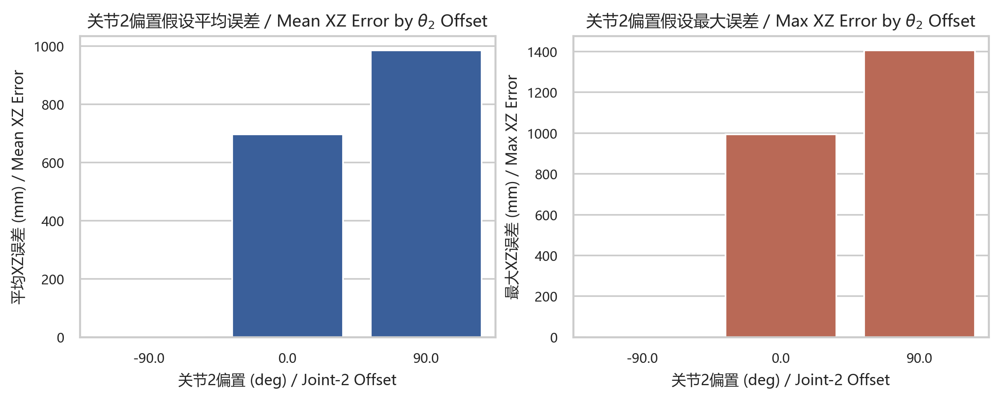

结论：当前 `DH` 参数与 `theta2_offset = -90°` 在工程内部是自洽的，可作为后续全部训练与推理的基础。

## 5. 子空间划分与标签系统

### 5.1 两套划分方案

当前工程保留两套划分配置：

| 配置 | q1 | q2 | q3 | q4 | q5 | q6 | 总子空间数 |
|---|---:|---:|---:|---:|---:|---:|---:|
| `abb_simplified` | 2 | 2 | 2 | 2 | 3 | 2 | 96 |
| `abb_strict` | 2 | 2 | 2 | 4 | 3 | 2 | 192 |

对应总数计算为：

$$
N_{\text{subspace}} = \prod_{j=1}^{6} n_j.
$$

在当前正式实验中，使用的是：

$$
2 \times 2 \times 2 \times 4 \times 3 \times 2 = 192.
$$

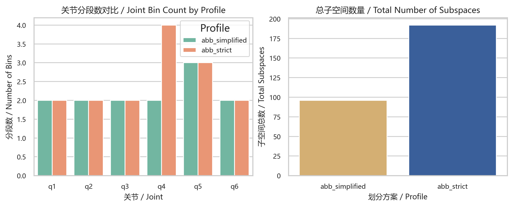

### 5.2 子空间编号方式

若第 $j$ 个关节所在分段编号为 $b_j$，该关节总分段数为 $n_j$，则全局子空间标签采用混合进制编码：

$$
s = (((((b_1 n_2 + b_2)n_3 + b_3)n_4 + b_4)n_5 + b_5)n_6 + b_6).
$$

其中：

- $b_j$ 从 `0` 开始计数
- $s \in [0, N_{\text{subspace}} - 1]$

这与 `abb_nn/subspace.py` 中 `encode_subspace_index(...)` 和 `decode_subspace_label(...)` 的逻辑一致。

### 5.3 分层分类的粗标签与细标签

当前 `abb_strict` 配置下，采用两层分类：

#### 第一层：粗分类 `coarse12`

由下列三个量共同构成：

$$
\begin{aligned}
b_{\text{shoulder}} &= \mathbb{1}[q_1 \ge 0], \\
b_{\text{elbow}} &= \mathbb{1}[q_3 \ge -65^\circ], \\
b_{\text{wrist}} &= \operatorname{bin}_{\{-45^\circ,\ 45^\circ\}}(q_5).
\end{aligned}
$$

因此粗分类总类别数为：

$$
2 \times 2 \times 3 = 12.
$$

#### 第二层：细分类 `fine16`

在粗分支已知的前提下，再预测剩余三个关节的子区间：

$$
(q2\_bin,\ q4\_bin,\ q6\_bin).
$$

对于 `abb_strict`：

$$
2 \times 4 \times 2 = 16.
$$

第二层再通过映射

$$
(\text{branch\_label},\ \text{fine\_label}) \rightarrow \text{subspace\_id}
$$

恢复到全局 `192` 个子空间之一。

## 6. 数据生成与特征构建

### 6.1 全局随机采样数据

全局数据生成的基本形式为：

$$
\mathbf{q}^{(i)} \sim \mathcal{U}(\mathcal{Q}),
$$

其中 $\mathcal{Q}$ 为关节限位构成的六维超矩形区域。随后通过 `FK` 生成对应位姿：

$$
\mathbf{x}^{(i)} = f_{\text{FK}}(\mathbf{q}^{(i)}).
$$

当前 `generate_dataset.py` 输出的核心字段包括：

- `q_deg`
- `position_mm`
- `rotation`
- `euler_rad_zyx`
- `T06`

### 6.2 子空间局部采样

对于某个子空间 $s$，先得到该子空间的边界：

$$
\mathcal{Q}_s = [q_1^{\min}, q_1^{\max}] \times \cdots \times [q_6^{\min}, q_6^{\max}],
$$

再进行均匀采样：

$$
\mathbf{q}^{(i)}_s \sim \mathcal{U}(\mathcal{Q}_s).
$$

这与 `sample_q_in_subspace_deg(...)` 的实现一致。

### 6.3 特征归一化

所有回归器与分类器都使用标准化特征：

$$
\tilde{\mathbf{x}} = \frac{\mathbf{x} - \boldsymbol{\mu}}{\boldsymbol{\sigma}}.
$$

其中：

- $\boldsymbol{\mu}$：样本均值
- $\boldsymbol{\sigma}$：样本标准差

当前均值和标准差都被写入各自的 `metadata.json` 中，推理阶段按同一参数做标准化。

## 7. 预测系统：子空间回归器

### 7.1 任务定义

对于每个子空间 $s$，当前采用两个局部回归网络：

$$
\hat{\mathbf{q}}_{1:5}^{(s)} = g_s^{(15)}(\tilde{\mathbf{x}}),
\qquad
\hat{q}_{6}^{(s)} = g_s^{(6)}(\tilde{\mathbf{x}}).
$$

最终拼接为：

$$
\hat{\mathbf{q}}^{(s)} = [\hat{q}_1,\hat{q}_2,\hat{q}_3,\hat{q}_4,\hat{q}_5,\hat{q}_6]^\top.
$$

### 7.2 网络结构

当前回归器采用 `MLPRegressor`，形式为：

- 输入维度：`6`
- 输出维度：`5` 或 `1`
- 激活函数：`ReLU`
- 正式模型超参数：
  - `hidden_layers = 3`
  - `neurons_per_layer = 20`

因此正式模型等价于：

$$
6 \rightarrow 20 \rightarrow 20 \rightarrow 20 \rightarrow 5
$$

和

$$
6 \rightarrow 20 \rightarrow 20 \rightarrow 20 \rightarrow 1.
$$

### 7.3 损失函数

对 $q_1 \sim q_5$ 和 $q_6$ 分别使用均方误差：

$$
\mathcal{L}_{1:5}^{(s)} = \frac{1}{N}\sum_{i=1}^{N}\lVert \hat{\mathbf{q}}_{1:5}^{(i,s)} - \mathbf{q}_{1:5}^{(i,s)} \rVert_2^2,
$$

$$
\mathcal{L}_{6}^{(s)} = \frac{1}{N}\sum_{i=1}^{N}(\hat{q}_{6}^{(i,s)} - q_6^{(i,s)})^2.
$$

单位说明：

- `mse(q1-5)` 单位为 `deg²`
- `mse(q6)` 单位为 `deg²`

### 7.4 回归器评价指标

对每个子空间，当前保存的关键指标包括：

#### 1. 验证集损失

- `val_loss_q15_deg2`
- `val_loss_q6_deg2`

#### 2. 测试集平均位置误差

对测试样本 $(\mathbf{x}_i, \mathbf{q}_i)$，回归器输出关节角后再通过 `FK` 回代，计算位置误差：

$$
e_{p,i}^{(s)} = \lVert \mathbf{p}(\hat{\mathbf{q}}_i^{(s)}) - \mathbf{p}_i^* \rVert_2.
$$

测试集平均位置误差为：

$$
\bar e_{p,\text{test}}^{(s)} = \frac{1}{N_{\text{test}}}\sum_{i=1}^{N_{\text{test}}} e_{p,i}^{(s)}.
$$

其在代码中对应：`test_pos_l2_mean_mm`，单位为 `mm`。

#### 3. 验证集最大位置误差 `e_max`

$$
e_{\max}^{(s)} = \max_{i \in \text{val}} \lVert \mathbf{p}(\hat{\mathbf{q}}_i^{(s)}) - \mathbf{p}_i^* \rVert_2.
$$

这不是关节角误差，而是**末端位置误差上界估计**，单位为 `mm`。当前推理阶段用它作为候选筛选失败时的回退阈值。

### 7.5 当前正式回归结果概览

当前正式模型为：

- `segment_profile = abb_strict`
- `subspace_count = 192`
- `trained_subspaces = 192`
- `samples_per_subspace = 100000`
- `epochs = 400`

基于 `figure/data/prediction_subspace_metrics.csv` 的汇总统计如下：

| 指标 | 数值 |
|---|---:|
| 子空间总数 | `192` |
| `q1-5` 验证 MSE 平均值 | `332.6695 deg²` |
| `q1-5` 验证 MSE 中位数 | `342.5140 deg²` |
| `q6` 验证 MSE 平均值 | `465.1991 deg²` |
| `q6` 验证 MSE 中位数 | `238.3765 deg²` |
| 测试集平均位置误差均值 | `83.2627 mm` |
| 测试集平均位置误差中位数 | `83.1365 mm` |
| `e_max` 均值 | `620.0359 mm` |
| `e_max` 中位数 | `546.7141 mm` |
| `e_max` 最小值 | `325.5852 mm` |
| `e_max` 最大值 | `1189.5448 mm` |

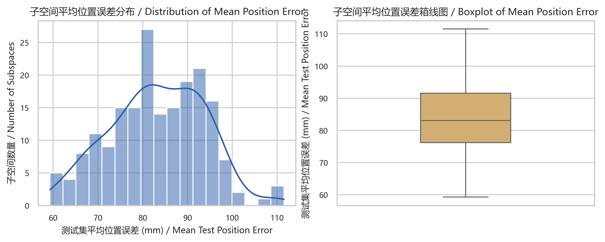

结论：

1. 当前子空间回归器能够提供可用初值，但单独作为最终逆解仍然偏粗。
2. `NR` 校正是必要环节，没有 `NR` 时很难达到工程精度要求。
3. 回归器的主要作用是把解带入数值法的有效收敛域，而不是一步到位直接输出高精度逆解。

## 8. 分类系统：基线与分层方案

### 8.1 单层 `192` 类分类基线

基线分类器直接学习：

$$
\hat s = c_{\text{flat}}(\tilde{\mathbf{x}}),
$$

其中 $\hat s$ 为全局子空间编号。

损失函数为：

$$
\mathcal{L}_{\text{flat}} = \operatorname{CE}(c_{\text{flat}}(\tilde{\mathbf{x}}), s).
$$

### 8.2 分层分类的设计动机

对于 ABB 机械臂，直接做 `192` 类分类会遇到两个问题：

1. 对称构型较多，位姿到具体子空间并非简单一一对应。
2. 直接预测完整子空间编号过细，`top-1` 准确率偏低。

因此当前将问题拆成两层：

1. 第一层：先判定大构型类型。
2. 第二层：在给定大构型条件下，再做局部细分。

### 8.3 第一层粗分类器

第一层网络为三头分类器：

$$
(\hat y_{\text{shoulder}}, \hat y_{\text{elbow}}, \hat y_{\text{wrist}})
= c_{\text{branch}}(\tilde{\mathbf{x}}).
$$

损失函数为三个交叉熵之和：

$$
\mathcal{L}_{\text{branch}} =\operatorname{CE}(\hat y_{\text{shoulder}}, y_{\text{shoulder}})+ \operatorname{CE}(\hat y_{\text{elbow}}, y_{\text{elbow}})+ \operatorname{CE}(\hat y_{\text{wrist}}, y_{\text{wrist}}).
$$

### 8.4 第二层细分类器

第二层输入不是单纯位姿，而是条件输入：

$$
\mathbf{z} = [\tilde{\mathbf{x}},\ \text{onehot}(\text{branch\_label})].
$$

在当前 `abb_strict` 设置下，输入维度为：

$$
6 + 12 = 18.
$$

细分类器学习：

$$
\hat f = c_{\text{fine}}(\mathbf{z}),
$$

损失函数为：

$$
\mathcal{L}_{\text{fine}} = \operatorname{CE}(c_{\text{fine}}(\mathbf{z}), f).
$$

### 8.5 分类器网络结构

分类器三种结构与 `Ref[22]` 迁移版保持一致：

| 变体 | 宽度 | 深度 | 残差 | BatchNorm |
|---|---:|---:|---:|---:|
| `v1` | 35 | 6 | 否 | 否 |
| `v2` | 35 | 20 | 是 | 否 |
| `v3` | 35 | 30 | 是 | 是 |

### 8.6 当前分类结果

基于 `figure/data/classification_metrics_summary.csv`，当前正式结果如下：

#### 单层 `192` 类分类器

| 变体 | Top-1 准确率 |
|---|---:|
| `v1` | `0.1110` |
| `v2` | `0.1422` |
| `v3` | `0.1416` |

#### 第一层粗分类器

| 变体 | Joint Acc | Shoulder Acc | Elbow Acc | Wrist Acc |
|---|---:|---:|---:|---:|
| `v1` | `0.2620` | `0.5965` | `0.6915` | `0.5938` |
| `v2` | `0.3068` | `0.6155` | `0.6923` | `0.6228` |
| `v3` | `0.3038` | `0.6115` | `0.6835` | `0.6218` |

#### 第二层细分类器

| 变体 | Top-1 准确率 | Top-3 准确率 |
|---|---:|---:|
| `v1` | `0.1980` | `0.5295` |
| `v2` | `0.4063` | `0.8050` |
| `v3` | `0.4425` | `0.8325` |

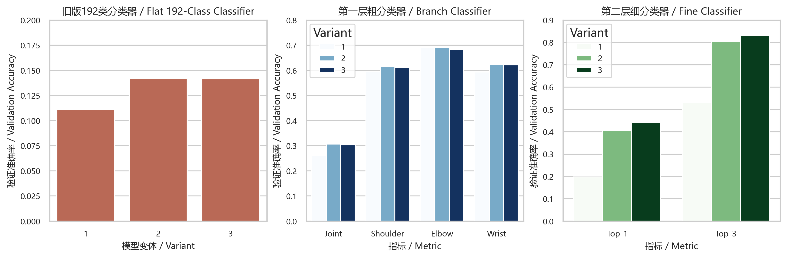

结论：

1. 对 ABB 机械臂，单层 `192` 类分类器 `top-1` 偏低，直接用于在线子空间定位并不稳健。
2. 粗分类器在结构上更贴近机械臂“大构型”判别。
3. 细分类器在粗分支条件下能把局部类别准确率提升到可用水平，特别是 `Top-3` 已达到 `0.8325`。

## 9. 候选生成、初值筛选与 NR 校正

### 9.1 粗分支候选生成

对每个第一层模型，分别对 `shoulder / elbow / wrist` 三个头取 `top-k`，再做笛卡尔积。某个粗分支候选的得分为：

$$
S_{\text{branch}}^{(m)}(b) =\log p_{\text{shoulder}}^{(m)}(b_s)+ \log p_{\text{elbow}}^{(m)}(b_e)+ \log p_{\text{wrist}}^{(m)}(b_w).
$$

当前实现对同一粗分支标签保留多模型中的最大得分。

### 9.2 细分类候选生成

对每个粗分支候选，构造条件输入 $\mathbf{z}$，并将三个细分类模型的对数概率相加：

$$
S_{\text{fine}}(f \mid b) = \sum_{m=1}^{3} \log p_m(f \mid b, \mathbf{z}).
$$

最终全局子空间得分为：

$$
S_{\text{subspace}}(s) = S_{\text{branch}}(b) + S_{\text{fine}}(f \mid b),
$$

其中 $s$ 由 $(b,f)$ 映射得到。

### 9.3 初值筛选

对于候选子空间集合 $\mathcal{C}$，逐个调用对应回归器得到初值 $\hat{\mathbf{q}}^{(s)}$，再通过 `FK` 计算位置误差：

$$
e_p^{(s)} = \lVert \mathbf{p}(\hat{\mathbf{q}}^{(s)}) - \mathbf{p}^* \rVert_2.
$$

选择初始误差最小的候选：

$$
s^* = \arg\min_{s \in \mathcal{C}} e_p^{(s)}.
$$

若该最优候选满足：

$$
e_p^{(s^*)} > e_{\max}^{(s^*)},
$$

则触发全子空间扫描回退机制。

### 9.4 阻尼 Newton-Raphson 校正

当前 `abb_nn/optimization.py` 中的更新公式为：

$$
\mathbf{q}_{k+1} = \mathbf{q}_k + \mathbf{J}(\mathbf{q}_k)^\top
\left( \mathbf{J}(\mathbf{q}_k)\mathbf{J}(\mathbf{q}_k)^\top + \lambda \mathbf{I} \right)^{-1}
\mathbf{e}_k,
$$

其中：

$$
\mathbf{e}_k = \mathbf{x}^* - \mathbf{x}(\mathbf{q}_k).
$$

姿态误差部分使用角度回绕处理：

$$
\mathbf{e}_{\text{ori}} \leftarrow (\mathbf{e}_{\text{ori}} + \pi) \bmod 2\pi - \pi.
$$

收敛判据为：

$$
\lVert \mathbf{e}_{\text{pos}} \rVert_2 \le \varepsilon_p,
\qquad
\lVert \mathbf{e}_{\text{ori}} \rVert_2 \le \varepsilon_o.
$$

当前默认阈值为：

- $\varepsilon_p = 10^{-3}\ \text{mm}$
- $\varepsilon_o = 10^{-3}\ \text{rad}$

### 9.5 单样本验证结果

当前正式链路已经完成如下单样本验证：

- 目标位姿：`[100, 200, 800, 0.1, -0.2, 0.3]`
- 模式：`hierarchical + NR`

关键结果如下：

| 指标 | 数值 |
|---|---:|
| 初始最优子空间 | `164` |
| 初始位置误差 | `44.8264 mm` |
| `NR` 迭代次数 | `4` |
| `NR` 是否收敛 | `True` |
| 最终位置误差 | `7.094e-05 mm` |
| 最终姿态误差 | `9.311e-07 rad` |
| 候选生成时间 | `10.2222 ms` |
| 初值筛选时间 | `15.4157 ms` |
| `NR` 时间 | `15.4391 ms` |
| 总时间 | `94.4150 ms` |

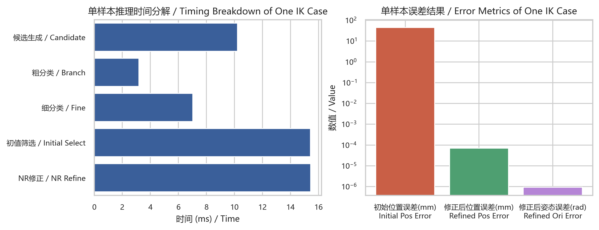

结论：神经网络回归器已经能提供足够好的初值，使得阻尼 `NR` 在极少迭代步内收敛到高精度解。

## 10. 工作空间参考样本与可视化

为了不重新训练全部子空间模型，又能为论文和可视化提供统一样本源，当前增加了子空间参考样本导出：

```powershell
python -X utf8 export_subspace_reference_data.py --segment_profile abb_strict --samples_per_subspace 512 --out_dir data/subspace_reference_abb_strict_samples512_seed2026 --seed 2026 --overwrite
```

当前目录：

- `data/subspace_reference_abb_strict_samples512_seed2026`

内容包括：

- `192` 个 `subspace_xxx_reference.npz`
- `1` 个 `metadata.json`

绘图时当前抽样使用了 `24576` 个参考点，得到的工作空间投影视图如下：

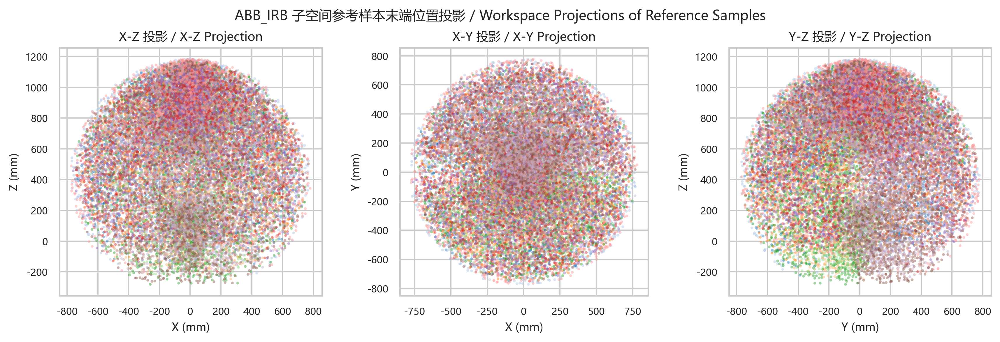

这些参考数据可直接用于：

1. 工作空间覆盖展示。
2. 子空间分布可视化。
3. 轨迹和碰撞检测的快速采样验证。
4. 论文中对样本空间与机械臂可达域的展示。

## 11. Benchmark 设计与当前结果

### 11.1 Benchmark 设计

当前 benchmark 脚本为：

- `figure/scripts/run_ik_benchmark.py`

其流程为：

1. 在关节限位内随机采样关节角。
2. 通过 `FK` 得到目标位姿。
3. 分别测试四种模式：
   - `flat + No NR`
   - `flat + NR`
   - `hierarchical + No NR`
   - `hierarchical + NR`
4. 统计位置误差、姿态误差、是否收敛、总耗时等指标。

### 11.2 工程成功率定义

当前采用严格的工程成功判据：

$$
\text{success}_i = \mathbb{1}
\left[
 e_{p,i} \le 1.0\ \text{mm}
 \ \land \ 
 e_{o,i} \le 10^{-2}\ \text{rad}
\right].
$$

因此总成功率定义为：

$$
\text{SR} = \frac{1}{N}\sum_{i=1}^{N} \text{success}_i.
$$

说明：旧版宽松定义下的误导性图已经删除，当前仅保留 `n100` 新口径结果。

### 11.3 当前 `100` 样本 benchmark 结果

基于 `figure/data/ik_benchmark_summary_n100.csv`，结果如下：

| 模式 | 工程成功率 | NR 收敛率 | 最终位置误差中位数 (mm) | 最终姿态误差中位数 (rad) | 总时间中位数 (ms) | 平均候选数 |
|---|---:|---:|---:|---:|---:|---:|
| `flat + No NR` | `0.00` | `0.00` | `36.9429` | `0.324373` | `36.1901` | `4.21` |
| `flat + NR` | `0.88` | `0.88` | `7.962e-05` | `3.673e-07` | `55.6374` | `4.21` |
| `hierarchical + No NR` | `0.00` | `0.00` | `32.6541` | `0.518540` | `77.7959` | `12.00` |
| `hierarchical + NR` | `0.78` | `0.78` | `6.866e-05` | `3.521e-07` | `101.1857` | `12.00` |

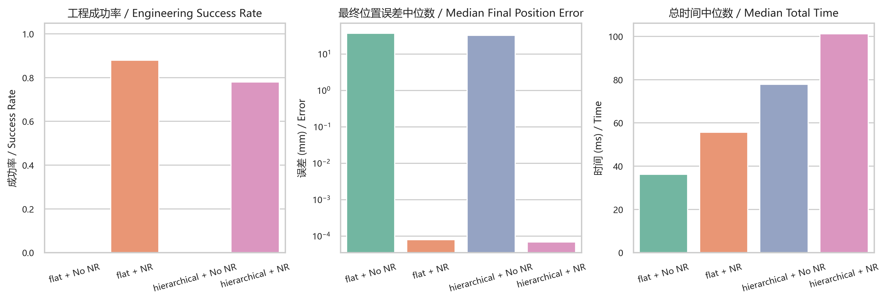

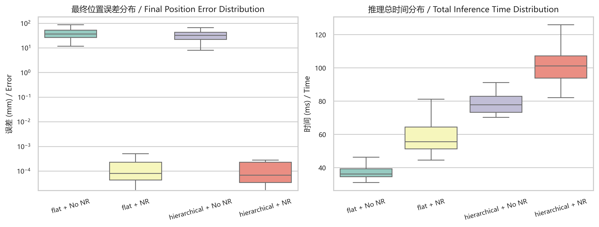

### 11.4 结果分析

1. `No NR` 的两种模式成功率都是 `0`，说明当前神经网络初值不能直接当作最终逆解使用。
2. `flat + NR` 当前是最强基线：
   - 成功率 `0.88`
   - 中位耗时 `55.64 ms`
3. `hierarchical + NR` 当前成功率为 `0.78`，低于 `flat + NR`，说明当前分层候选参数在召回率上仍有优化空间。
4. 两种 `+NR` 模式一旦成功，最终误差都能降到近乎数值精度极限，说明核心瓶颈不是 `NR`，而是候选子空间召回与初值质量。
5. 当前 benchmark 的时间包含脚本调用、模型加载和 `JSON` 读写，不等同于常驻服务下的纯推理时间。

## 12. 六组逆解方法对比实验

### 12.1 对比组定义

当前新增的对比组如下：

| 组别 | 名称 | 定义 |
|---|---|---|
| `G1` | `NN only` | 当前分层分类候选生成 + 子空间回归器初值预测，不做 `NR` 校正 |
| `G2` | `NN + NR` | 在 `NN only` 基础上增加阻尼 `NR` 局部精修 |
| `G3` | `DLS` | 单初值阻尼最小二乘逆解，固定初值为机械臂零位 |
| `G4` | `Multi-start DLS` | `10` 组初值的 `DLS`，包含 `1` 组零位初值和 `9` 组随机初值 |
| `G5` | `L-BFGS-B` | 单初值有界优化逆解，固定初值为机械臂零位 |
| `G6` | `Multi-start L-BFGS-B` | `10` 组初值的 `L-BFGS-B`，包含 `1` 组零位初值和 `9` 组随机初值 |

### 12.2 统一实验设置

本轮对比实验采用统一设置：

1. 测试样本数：`N = 100`
2. 随机种子：`2026`
3. 测试场景：`cold-start`
4. 目标位姿生成方式：先在关节限位内采样关节角，再通过 `FK` 生成目标位姿
5. 运行平台：统一在同一 `CPU` 进程内完成，避免脚本启动与模型重复加载造成的时间偏差
6. 多初值数量：`M = 10`
7. 神经网络候选生成参数：
   - `topk_shoulder = 2`
   - `topk_elbow = 1`
   - `topk_wrist = 2`
   - `max_branch_candidates = 6`
   - `fine_topk_per_branch = 3`
   - `max_subspace_candidates = 18`
8. `DLS` 参数：
   - `max_iters = 80`
   - `damping = 1e-2`
   - `orientation_weight = 200`
9. `L-BFGS-B` 参数：
   - `max_iters = 200`
   - `orientation_weight = 200`

对应目标样本生成公式为：

$$
\mathbf{q}^{(i)} \sim \mathcal{U}(\mathcal{Q}),
\qquad
\mathbf{x}^{(i)} = f_{\mathrm{FK}}(\mathbf{q}^{(i)}),
\qquad i=1,\dots,N.
$$

### 12.3 数值法与 benchmark 指标定义

对于局部迭代数值法，先定义加权位姿误差向量：

$$
\tilde{\mathbf{e}}(\mathbf{q})=
\begin{bmatrix}
\mathbf{p}^{*}-\mathbf{p}(\mathbf{q}) \\
w_o\,\mathrm{wrap}\!\left(\boldsymbol{\eta}^{*}-\boldsymbol{\eta}(\mathbf{q})\right)
\end{bmatrix},
$$

其中：

- $\mathbf{p}$ 为末端位置
- $\boldsymbol{\eta}$ 为 `ZYX Euler` 姿态向量
- $w_o$ 为姿态权重，当前取 `200`

对应加权雅可比记为：

$$
\tilde{\mathbf{J}}(\mathbf{q})=
\begin{bmatrix}
\mathbf{J}_{p}(\mathbf{q}) \\
w_o\,\mathbf{J}_{o}(\mathbf{q})
\end{bmatrix}.
$$

`DLS` 更新公式为：

$$
\Delta \mathbf{q}=
\tilde{\mathbf{J}}^\top
\left(
\tilde{\mathbf{J}}\tilde{\mathbf{J}}^\top + \lambda \mathbf{I}
\right)^{-1}
\tilde{\mathbf{e}},
$$

$$
\mathbf{q}_{k+1}=\mathbf{q}_k+\Delta \mathbf{q}.
$$

`L-BFGS-B` 的优化目标函数为：

$$
F(\mathbf{q})=
\frac{1}{2}\,
\tilde{\mathbf{e}}(\mathbf{q})^\top
\tilde{\mathbf{e}}(\mathbf{q}),
\qquad
\mathbf{q}\in\mathcal{Q}.
$$

多初值方法的最终输出定义为：

$$
\mathbf{q}^{*}=
\arg\min_{\mathbf{q}_j \in \mathcal{S}}
F(\mathbf{q}_j),
$$

其中 $\mathcal{S}$ 为所有起始点对应的求解结果集合。

本轮实验统一采用以下核心评价指标：

位置误差：

$$
e_p = \|\mathbf{p}(\mathbf{q})-\mathbf{p}^{*}\|_2.
$$

姿态误差：

$$
e_R=
\arccos
\left(
\frac{\mathrm{tr}\!\left(\mathbf{R}^{*\top}\mathbf{R}(\mathbf{q})\right)-1}{2}
\right).
$$

工程成功判据：

$$
\mathrm{success}=
\mathbb{1}
\left[
e_p \le 1.0\ \mathrm{mm}
\ \land\
e_R \le 10^{-2}\ \mathrm{rad}
\ \land\
\mathbf{q}\in\mathcal{Q}
\right].
$$

成功率：

$$
\mathrm{SR}=\frac{1}{N}\sum_{i=1}^{N}\mathrm{success}_i.
$$

收敛率：

$$
\mathrm{CR}=\frac{1}{N}\sum_{i=1}^{N}\mathrm{converged}_i.
$$

经验分布函数 `ECDF` 定义为：

$$
F_{z}(\tau)=\frac{1}{N}\sum_{i=1}^{N}\mathbb{1}[z_i\le \tau],
$$

其中 $z$ 可以取位置误差、姿态误差或迭代次数。

`P95` 统计量定义为：

$$
P95(z)=\inf\{\tau \mid F_z(\tau)\ge 0.95\}.
$$

当前 `figure/data/ik_benchmark_six_methods_summary_n100.csv` 中各字段的含义如下：

| 字段 | 定义 | 单位 |
|---|---|---|
| `success_rate` | 满足工程成功判据的样本比例 | `-` |
| `converged_rate` | 数值过程报告收敛的样本比例 | `-` |
| `mean_final_pos_err_mm` | 最终位置误差均值 | `mm` |
| `median_final_pos_err_mm` | 最终位置误差中位数 | `mm` |
| `p95_final_pos_err_mm` | 最终位置误差 `P95` | `mm` |
| `mean_final_ori_err_rad` | 最终姿态误差均值 | `rad` |
| `median_final_ori_err_rad` | 最终姿态误差中位数 | `rad` |
| `p95_final_ori_err_rad` | 最终姿态误差 `P95` | `rad` |
| `mean_solve_time_ms` | 单样本求解时间均值 | `ms` |
| `median_solve_time_ms` | 单样本求解时间中位数 | `ms` |
| `p95_solve_time_ms` | 单样本求解时间 `P95` | `ms` |
| `mean_iters` | 平均迭代次数 | `step` |
| `mean_starts_used` | 平均起点数 | `start` |
| `mean_candidate_count` | 平均候选子空间数 | `count` |

补充说明：

1. `NN only` 不进行局部迭代，因此 `iters = 0`。
2. `NN + NR` 的 `iters` 是 `Newton-Raphson` 迭代次数。
3. `DLS / L-BFGS-B` 的 `iters` 是单次数值优化迭代次数。
4. `Multi-start DLS / Multi-start L-BFGS-B` 的 `iters` 是“最终被选中最佳解”对应那一次优化的迭代数，而不是全部起点迭代数之和；因此多初值方法的总体计算开销应优先结合 `solve_time_ms` 解读。
5. `mean_candidate_count` 仅对 `NN only` 和 `NN + NR` 有意义，因为传统数值法不经过子空间候选生成。

### 12.4 运行命令与输出文件

本轮正式对比实验运行命令为：

```powershell
conda activate arm_nn
python -X utf8 figure/scripts/run_ik_benchmark_six_methods.py --n_samples 100 --seed 2026 --tag n100
```

生成结果如下：

1. 明细结果：
   - `figure/data/ik_benchmark_six_methods_detailed_n100.csv`
2. 汇总结果：
   - `figure/data/ik_benchmark_six_methods_summary_n100.csv`
3. 图表：
   - `figure/figures/ik_benchmark_six_methods_summary_n100.png`
   - `figure/figures/ik_benchmark_six_methods_distribution_n100.png`
   - `figure/figures/ik_benchmark_six_methods_cdf_n100.png`
   - `figure/figures/ik_benchmark_six_methods_iterations_n100.png`

其中：

1. `summary` 图用于总览成功率、时间与误差关键统计量。
2. `distribution` 图为最终版四联图，统一采用 `ECDF + 阈值达标率` 形式展示位置误差与姿态误差。
3. `cdf` 图为位置误差的补充独立视图，用于与四联图结果互相校核。
4. `iterations` 图为最终版双图，左侧为迭代分档占比，右侧为 `Median + P95` 柱状统计。

### 12.5 当前 `n=100` 对比结果

基于最新的 `figure/data/ik_benchmark_six_methods_summary_n100.csv`，结果如下：

| 方法 | 成功率 | 收敛率 | 位置误差中位数 (mm) | 姿态误差中位数 (rad) | 求解时间中位数 (ms) | 平均迭代次数 |
|---|---:|---:|---:|---:|---:|---:|
| `NN only` | `0.00` | `0.00` | `28.7513` | `0.522755` | `21.9387` | `0.00` |
| `NN + NR` | `0.78` | `0.78` | `9.6478e-06` | `1.7504e-07` | `28.3909` | `14.00` |
| `DLS` | `0.39` | `0.39` | `23.0801` | `0.443023` | `48.0071` | `56.85` |
| `Multi-start DLS` | `0.90` | `0.90` | `0.0313` | `1.8491e-04` | `369.9340` | `22.77` |
| `L-BFGS-B` | `0.35` | `0.35` | `322.8446` | `1.265804` | `63.5474` | `22.26` |
| `Multi-start L-BFGS-B` | `0.92` | `0.92` | `9.0951e-09` | `0.0` | `419.8229` | `35.45` |

从汇总表可以先得到三个直接结论：

1. `NN only` 虽然最快，但误差仍远大于工程阈值，因此不能作为最终逆解方案。
2. `NN + NR` 在中位时间仅 `28.39 ms` 的情况下，将位置与姿态误差分别压到 `10^{-6} mm` 和 `10^{-7} rad` 量级，是当前速度与精度最均衡的方案。
3. 多初值数值法成功率最高，其中 `Multi-start L-BFGS-B` 达到 `0.92`，但时间代价也最高，说明鲁棒性提升主要来自更大的计算预算。

### 12.6 图表说明与结果分析

#### 12.6.1 汇总图 `ik_benchmark_six_methods_summary_n100.png`

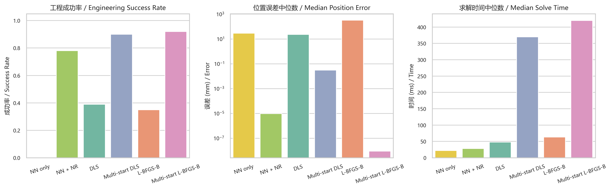

该图用于并列展示四类关键指标：

1. 成功率 `success_rate`
2. 中位求解时间 `median_solve_time_ms`
3. 中位位置误差 `median_final_pos_err_mm`
4. 中位姿态误差 `median_final_ori_err_rad`

其作用是先给出整体排序，再配合后续分布图查看尾部分布。

从汇总图可见：

1. `NN only` 的中位时间最短，但成功率为 `0`，说明单独神经网络回归器只能提供初值。
2. `NN + NR` 在速度上明显优于四种纯数值法，同时误差达到数值精度级别，是当前工程主推荐方案。
3. 单起点 `DLS` 与单起点 `L-BFGS-B` 成功率分别仅为 `0.39` 与 `0.35`，说明在 `cold-start` 下它们对初值极为敏感。
4. `Multi-start DLS` 与 `Multi-start L-BFGS-B` 的成功率提升到 `0.90` 和 `0.92`，但其时间中位数分别增至 `369.93 ms` 和 `419.82 ms`，在线应用成本较高。

#### 12.6.2 四联误差图 `ik_benchmark_six_methods_distribution_n100.png`

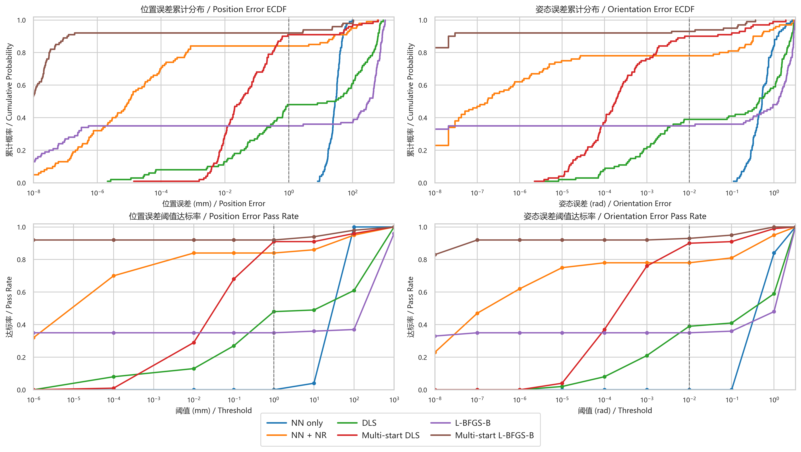

该图是当前误差对比的最终版本，包含四个子图：

1. 左上：位置误差 `ECDF`
2. 右上：姿态误差 `ECDF`
3. 左下：位置误差阈值达标率
4. 右下：姿态误差阈值达标率

其中虚线分别表示工程阈值：

$$
e_p = 1.0\ \mathrm{mm},
\qquad
e_R = 10^{-2}\ \mathrm{rad}.
$$

阈值达标率图中某条曲线在阈值 $\tau$ 处的值定义为：

$$
\mathrm{PassRate}(\tau)=\frac{1}{N}\sum_{i=1}^{N}\mathbb{1}[e_i\le\tau].
$$

这张图的主要信息如下：

1. 在位置误差和姿态误差两个 `ECDF` 子图中，`NN + NR` 和两种多初值方法的曲线都明显比单起点方法更靠左上，说明它们在绝大多数样本上都能达到更小误差。
2. `NN + NR` 在工程阈值处的位置达标率与姿态达标率均为 `0.78`，与汇总表中的成功率一致，说明其失败样本主要不是偶发数值噪声，而是候选召回或初值质量问题。
3. `Multi-start L-BFGS-B` 在小误差区最靠前，说明其最终精度最强；但这并不意味着它最实用，因为时间成本显著更高。
4. `DLS` 与 `L-BFGS-B` 的曲线在低误差区上升较慢，说明单起点传统数值法在本实验设置下存在明显的初值敏感问题。
5. `NN only` 的曲线整体位于高误差区，进一步验证“神经网络初值 + 局部数值修正”才是合理使用方式。

#### 12.6.3 位置误差补充图 `ik_benchmark_six_methods_cdf_n100.png`

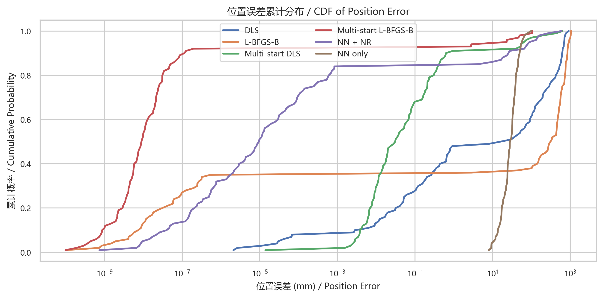

该图单独抽出位置误差 `ECDF`，作为四联误差图左上子图的补充放大版本。其主要作用有两点：

1. 在不受姿态误差与阈值达标率子图干扰的情况下，更清晰地观察位置误差曲线的相对排序。
2. 便于在论文中单独引用“位置精度”这一项，而无需同时展示姿态与阈值子图。

从该图可再次确认：

1. `Multi-start L-BFGS-B` 与 `NN + NR` 在位置误差维度明显领先。
2. `Multi-start DLS` 的位置精度也较强，但其时间代价远高于 `NN + NR`。
3. 单起点 `L-BFGS-B` 的位置误差最差，中位位置误差达到 `322.84 mm`，说明该方法在当前初值设定下并不适合作为冷启动主方案。

#### 12.6.4 迭代统计图 `ik_benchmark_six_methods_iterations_n100.png`

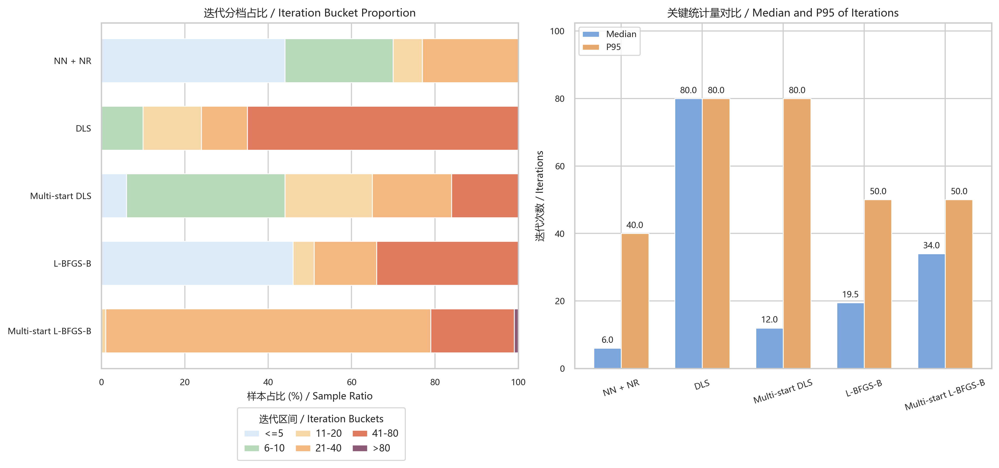

该图是当前迭代行为分析的最终版本，包含两个子图：

1. 左图：迭代分档占比
2. 右图：`Median` 与 `P95` 迭代次数柱状图

左图的分档比例定义为：

$$
\rho_{m,b}=\frac{1}{N}\sum_{i=1}^{N}\mathbb{1}[\mathrm{iters}_{m,i}\in b],
$$

其中分档区间设置为：

$$
\{\le 5,\ 6\text{-}10,\ 11\text{-}20,\ 21\text{-}40,\ 41\text{-}80,\ >80\}.
$$

右图中：

1. `Median` 反映典型样本所需迭代次数
2. `P95` 反映尾部困难样本的迭代代价

从图中可以读出：

1. `NN + NR` 的中位迭代次数仅为 `6`，`44%` 的样本在 `<=5` 步内完成，`70%` 的样本在 `<=10` 步内完成，说明只要初值足够接近真实解，`NR` 修正过程通常很快。
2. `DLS` 的中位迭代次数和 `P95` 都为 `80`，且 `65%` 的样本落在 `41-80` 区间，说明单起点 `DLS` 在本实验中经常逼近迭代上限。
3. `Multi-start DLS` 的中位迭代次数降至 `12`，表明更好的起点能显著改善局部收敛速度；但 `P95` 仍为 `80`，说明其尾部样本仍然存在高成本。
4. `L-BFGS-B` 的 `Median = 19.5`，`P95 = 50`，表现出一定的两极分化特征：部分样本很快结束，但失败样本误差很大。
5. `Multi-start L-BFGS-B` 的被选中最佳解多数集中在 `21-40` 步，`Median = 34`，`P95 = 50`，说明其最终解质量较高，但典型迭代成本并不低。

需要再次强调：对于多初值方法，迭代图里的 `iters` 只对应“被选中最佳解”的单次优化迭代次数，不代表全部 `10` 个起点的总迭代次数；因此其总体代价仍应以 `solve_time_ms` 为准。

### 12.7 综合结论

本轮六组方法对比可以归纳为以下结论：

1. `NN only` 不能直接替代逆解数值修正，但可作为有效初值生成器。
2. `NN + NR` 以 `28.39 ms` 的中位时间获得 `0.78` 的成功率，并在成功样本上达到接近机器精度的末端误差，是当前最具工程平衡性的方案。
3. 单起点 `DLS` 和单起点 `L-BFGS-B` 在 `cold-start` 下都表现出明显的初值敏感性，不适合作为默认在线求解策略。
4. `Multi-start DLS` 与 `Multi-start L-BFGS-B` 通过增加计算预算显著提高了鲁棒性，但时间代价增大到 `370~420 ms` 量级，更适合作为高可靠性离线求解或校核基线。
5. 因此，当前工程中引入神经网络的核心价值不是完全取代传统数值法，而是为局部数值修正提供更好的初始点，从而在保持高精度的同时显著降低在线求解时间。

## 13. 当前正式工件与建议保留内容

### 13.1 训练与推理核心工件

建议保留：

- `artifacts/prediction_system_formal/`
- `artifacts/classification_system_formal/`
- `artifacts/branch_classification_system/`
- `artifacts/fine_classification_system/`
- `artifacts/fk_validation/`
- `artifacts/subspace_validation/`

### 13.2 数据与参考样本

建议保留：

- `data/subspace_reference_abb_strict_samples512_seed2026/`

### 13.3 图表与表格

建议保留：

- `figure/figures/*.png`
- `figure/data/*.csv`

因为这些结果可以直接用于论文中的：

1. 参数验证图。
2. 子空间配置图。
3. 分类效果图。
4. 回归误差图。
5. 基准测试图。

## 14. 复现实验命令

### 14.1 环境

```powershell
conda activate arm_nn
cd E:\CSU\毕业设计\ABB_Arm_Control
```

### 14.2 训练 `192` 子空间回归器

```powershell
python -X utf8 train_prediction_models.py --segment_profile abb_strict --samples_per_subspace 100000 --epochs 400 --batch_size 4096 --hidden_layers 3 --neurons_per_layer 20 --train_ratio 0.7 --val_ratio 0.15 --test_ratio 0.15 --normalizer_samples 200000 --feature_batch_size 8192 --out_dir artifacts/prediction_system_formal
```

### 14.3 训练单层 `192` 类分类器基线

```powershell
python -X utf8 train_classification_models.py --segment_profile abb_strict --trainset_v1 400000 --trainset_v2 600000 --trainset_v3 500000 --val_samples 5000 --epochs 80 --batch_size 4096 --feature_batch_size 8192 --out_dir artifacts/classification_system_formal
```

### 14.4 训练第一层粗分类器

```powershell
python -X utf8 train_branch_classification_models.py --segment_profile abb_strict --trainset_v1 250000 --trainset_v2 400000 --trainset_v3 320000 --val_samples 4000 --epochs 60 --batch_size 4096 --feature_batch_size 8192 --out_dir artifacts/branch_classification_system
```

### 14.5 训练第二层细分类器

```powershell
python -X utf8 train_fine_classification_models.py --segment_profile abb_strict --trainset_v1 250000 --trainset_v2 400000 --trainset_v3 320000 --val_samples 4000 --epochs 60 --batch_size 4096 --feature_batch_size 8192 --out_dir artifacts/fine_classification_system
```

### 14.6 完整逆解推理

```powershell
python -X utf8 predict_ik.py --candidate_mode hierarchical --pose "100,200,800,0.1,-0.2,0.3" --pred_meta artifacts/prediction_system_formal/metadata.json --branch_meta artifacts/branch_classification_system/metadata.json --fine_meta artifacts/fine_classification_system/metadata.json --topk_shoulder 2 --topk_elbow 1 --topk_wrist 2 --max_branch_candidates 4 --fine_topk_per_branch 3 --max_subspace_candidates 15 --enable_nr --out_json artifacts/fine_classification_system/test_pose_001_full_ik.json
```

### 14.7 参考样本导出

```powershell
python -X utf8 export_subspace_reference_data.py --segment_profile abb_strict --samples_per_subspace 512 --out_dir data/subspace_reference_abb_strict_samples512_seed2026 --seed 2026 --overwrite
```

### 14.8 图表生成

```powershell
python -X utf8 figure/scripts/generate_core_figures.py
python -X utf8 figure/scripts/generate_workspace_figures.py
python -X utf8 figure/scripts/run_ik_benchmark.py --n_samples 100 --seed 2026 --success_pos_mm 1.0 --success_ori_rad 1e-2
python -X utf8 figure/scripts/run_ik_benchmark_six_methods.py --n_samples 100 --seed 2026 --tag n100
```

## 15. 当前阶段结论与下一步优化方向

### 15.1 当前结论

1. `ABB_IRB` 的 `FK` 建模已经稳定，`theta2_offset = -90°` 有明确数值验证支撑。
2. `192` 个子空间回归器已经全部训练完成，能够稳定提供局部逆解初值。
3. 单层 `192` 类分类器可以作为基线，但不适合直接作为最终候选生成核心。
4. 两层分层分类器更符合 ABB 机械臂的构型特征。
5. `NN + NR` 已经能够在单样本和随机样本 benchmark 中达到高精度逆解。
6. 当前工程中真正的瓶颈已经从“局部修正精度”转移到“候选子空间召回率与速度权衡”。

### 15.2 下一步可优化方向

1. 调整分层候选参数，提高 `hierarchical + NR` 的召回率。
2. 研究常驻模型加载，消除脚本级启动耗时。
3. 对候选初值的排序准则加入姿态误差项，而不是只看位置误差。
4. 继续推进受限空间、障碍物建模与轨迹级碰撞检测。
5. 将当前图表、公式和 benchmark 结果进一步整理为论文章节内容。

## 16. 文档导航

- 项目总说明：`README.md`
- 时间顺序记录：`Summary.md`
- 参数与资料：`docs/`
- 图表结果：`figure/figures/`
- 图表数据：`figure/data/`
- 正式模型工件：`artifacts/`
